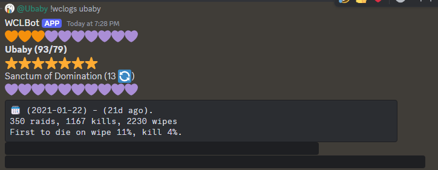
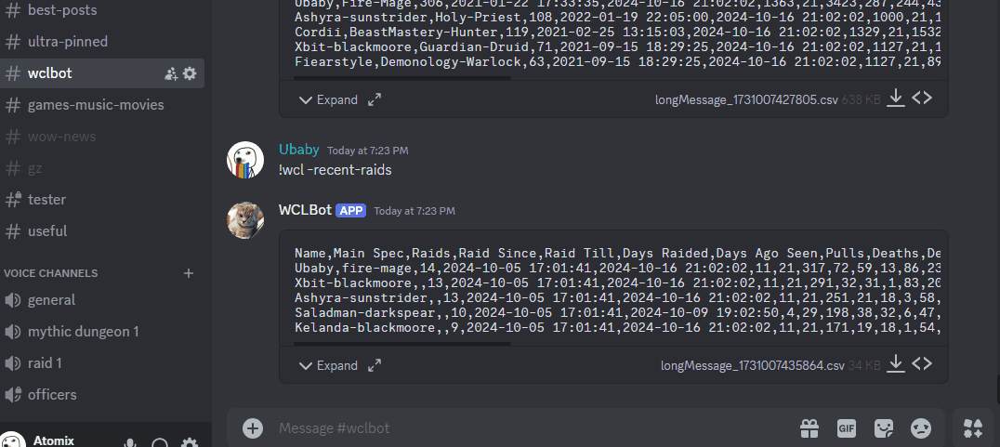
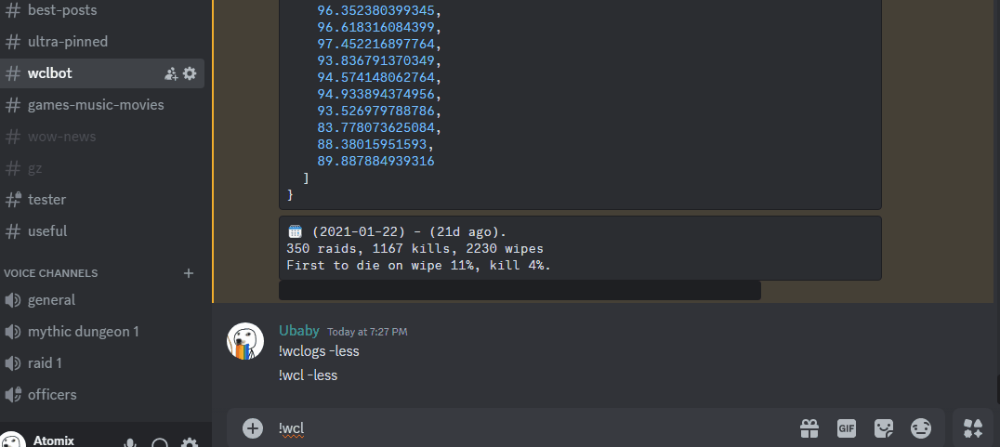

# WoW Discord Bot



A Discord bot built with TypeScript for World of Warcraft raid management and performance tracking. The bot integrates with Warcraft Logs to provide raid insights and features a modular command system for easy expansion.

## Features

- **Raid Performance Tracking**: Integration with Warcraft Logs API
- **Flexible Command System**: Modular design for easy feature expansion
- **Data Management**: Local SQLite storage with Firebase integration
- **AI Integration**: GPT-powered responses for enhanced interaction

## Examples




## Commands

All commands use the `!wcl` prefix:

```
-available     Check availability status
-tell          Get raid details
-signup        Sign up for raid composition
-alt           Manage alternative characters
-help          Display all available commands
-gpt           Get AI-powered responses
-pet           Access pet-related features
-more          Show expanded data in responses
-less          Show condensed data in responses
-all-raids     View all raid logs
-recent-raids  View recent raid logs
-latest-raids  View latest raid logs
raider io link Auto activates to show raid experience and skill level
wclogs link    Auto activates to show raid experience and skill level
wclogs link -save allows saving whole raid experience to track overal kills, deaths with current team
```

## Technical Stack

- **Language**: TypeScript
- **Database**: SQLite (local), Firebase (cloud)
- **APIs**:
  - Warcraft Logs (GraphQL)
  - Discord.js
  - OpenAI GPT

## Installation

Currently private

<!--
1. Clone the repository
2. Install dependencies:
   ```bash
   npm install
   ```
3. Configure environment variables in `.env`:
   - Discord Bot Token
   - Warcraft Logs API Key
   - OpenAI API Key
   - Firebase credentials
4. Start the bot:
   ```bash
   npm start
   ``` -->

## Privacy & Security

This bot handles user data privately and securely:

- Environment variables for sensitive credentials
- Local SQLite database for data storage
- Controlled access to protect user information

## Future Development

The bot is designed for easy expansion with:

- Modular command registration system
- Flexible data formatting interfaces
- Service-based architecture

## License

Currently private

<!-- MIT License -->
